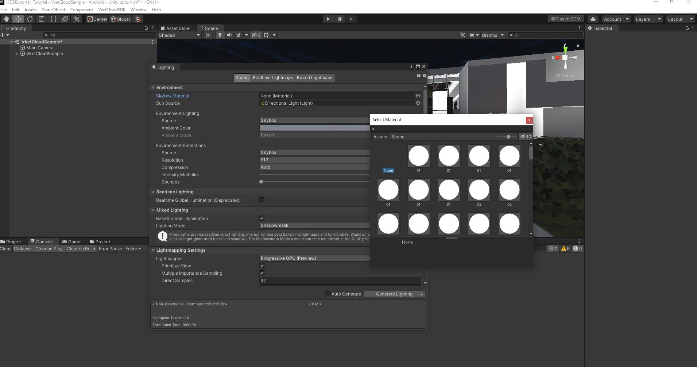
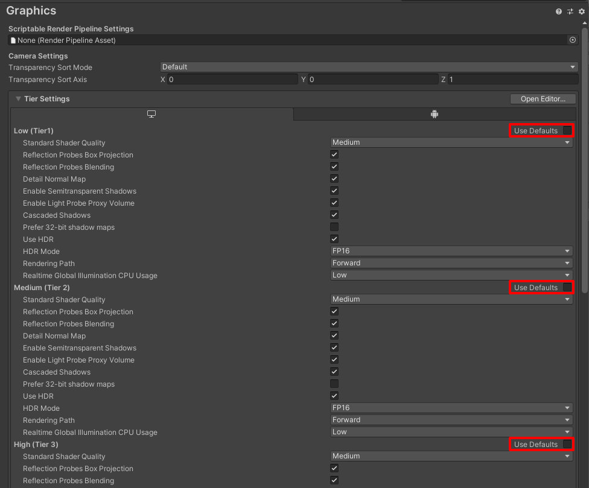

# Unity settings for replicating actual look in Vket Cloud

There are still some functions that are not available in Vket Cloud, such as global illumination.
Apply the below settings to make your Unity Scene look closer to the final Vket Cloud output.

## About Global Illumination

VketCloud does not support real-time global illumination, so please express it with lightmaps. See [Unity Guidelines/Lightmaps](../WorldMakingGuide/UnityGuidelines.md#_6) (If the appearance differs between Unity and VketCloud, it's mostly likely due to issues around GI).

## Set Skybox to None

Unity's Skybox setting under the Light Setting applies global illumination to the Scene and alters its look. Set this to None.
It's still fine to set a Skybox when capturing your reflection probes. ([Create Reflection Probe](../WorldMakingGuide/ReflectionProbe.md))

## Change the Settings of StandardShader

The physically based rendering on Vket Cloud uses the same algorithm (GGX) as Unity's Medium level, so you will need to make some changes in the settings.

1. Open Edit/ProjectSettings/Graphics

    

    

2. In the Tier Settings, uncheck "Use Defaults" on Low, Medium, and High

    

3. In the Tier Settings, change the "Standard Shader Quality" on Low, Medium, and High, to "Medium"

    

## Check if the Color Space is Set to Linear

Open Edit/Project Settings/Player/Other Settings, and check if Color Space is set to Linear.

