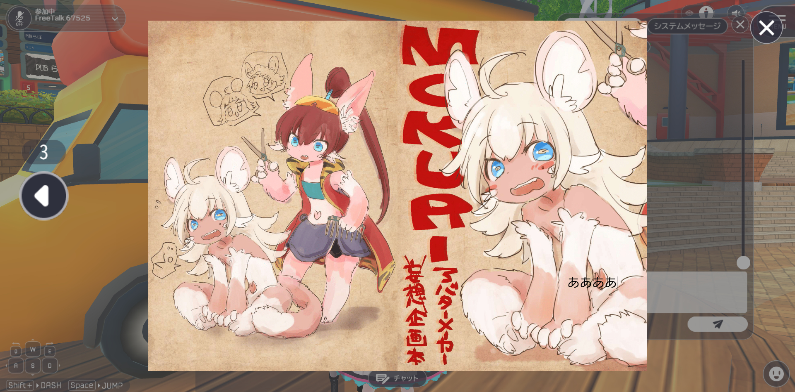

# How to Hide Existing UI and Input Fields When Implementing an Activity Canvas

When displaying newly implemented UI in an Activity, there may be situations where you want to temporarily hide existing UI. Additionally, even if the UI is hidden, input fields such as text chat and voice chat channel names may remain visible.  
In this article, we'll introduce how to remove these UI elements.



!!! info
    SDK Version: 14.1.2<br>
    OS: Windows 10<br>
    Unity: 2019.3.6f1<br>
    Browser: Google Chrome<br>

## How to Hide Existing UI

Simply call `hsCanvasSuspendVisibleLayers()` at the timing when you want to hide the existing UI. To restore the hidden existing UI, use `hsCanvasResumeVisibleLayers()`.

These two methods appeared from **Lib14 onwards**, and **cannot be used in Lib13 or earlier**.  
Note that using these methods **does not** remove the text in the input fields.

## How to Hide Input Fields

On the Vket Cloud HUD, there are two input fields:

- Text chat input field
- Voice chat channel name input field

(If you include the Menu, there’s also an input field to change the player name.)

To hide these input fields, you need to hide the corresponding HTML elements. When you hide the Activity’s GUI, you will also need to restore them to their original state upon making them visible again.

However, for the voice chat channel name input field, you need to branch your logic depending on whether it was originally displayed or not.  
(If it wasn’t originally displayed but you try to display it, the input field will appear in the top-left corner of the screen.)


The input field. Although small, it does appear.

To hide an HTML element, use the JavaScript function `hel_set_HTMLElement_visibility(string elementName, bool visibility)`.

## Coding Example

Below is an example of how to hide the existing UI + input fields when displaying the Activity GUI, and then restore them to their original state when hiding the Activity GUI.

```
// JavaScript function to toggle the visibility of HTML elements
extern {
    void hel_set_HTMLElement_visibility(string elementName, bool visibility);
}

// Whether or not the voice chat channel input field is displayed
bool _isChannelCreateShow;

// Names of the HTML elements for the input fields and the layer where the voice chat channel input field is located
const string _TextchatElementName = "textchat-text";
const string _ChannelnameElementName = "channelname-text";
const string _ChannnelCreateLayerName = "vcc_setting_channel_window";

private LayerBundle _channelCreateLayer;

_channelCreateLayer = hsLayerGet(_ChannnelCreateLayerName);

// Processing required when displaying the GUI for the Activity
void ActivityGUIShow(){
  // Check if the voice chat channel input field is currently visible
  _isChannelCreateShow = _channelCreateLayer.IsShow();
  
  // Hide the existing UI
  hsCanvasSuspendVisibleLayers();
  
  // Hide the input fields
  hel_set_HTMLElement_visibility(_TextchatElementName, false);
  hel_set_HTMLElement_visibility(_ChannelnameElementName, false);
}

// Processing required when hiding the GUI for the Activity
void ActivityGUIHide(){
  // Show the existing UI
  hsCanvasResumeVisibleLayers();

  // Show the input fields (the voice chat channel input field’s visibility depends on its state during the hide command)
  hel_set_HTMLElement_visibility(_TextchatElementName, true);
  hel_set_HTMLElement_visibility(_ChannelnameElementName, _isChannelCreateShow);
}
```

## Important Notes

IsShow(), which is used to check the visibility of the voice chat channel input field, does not work correctly if it’s called from a HeliScript inside a Canvas.

```
Activity
├ Canvas
│ ├ HeliScript
│ │ └ VCCChannelIsShow.hs × NG
│ ├ landscape
│ └ portrait
└ HeliScript
   └ VCCChannelIsShow.hs ○ OK
```
Make sure to run it in the ActivityHeliScript instead.
