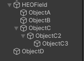

# HeliScript - Overview

Vket Cloud allows programming using the engine's own script called HeliScript. <br>
Using HeliScript, you can implement more complex gimmicks and behaviors compared to using [Actions](../Actions/ActionsOverview.md).

You can learn about the syntax of HeliScript by reading it in order starting from [Built-in types](./hs_var.md). <br>
As an example, we will show a basic implementation of displaying "Hello World" on the console.

## Example of how to use HeliScript (displaying Hello World on the console)

### 1. Add a HeliScript file to Assets Folder


First, create a file to write HeliScript. <br>
Right-click in the Project window (where folder such as Assets are located), select **"HS script"**, and add the HeliScript file to any folder.

As an example, a Scripts folder is newly added to the Assets folder, followed by creating a new HeliScript file with the name `HelloWorld.hs`.


### 2. Add HEOScript to the scene


After adding the HeliScript file, the next step is to configure HeliScript in the scene. <pr>
HeliScript appears in the scene using the [HEOScript](../HEOComponents/HEOScript.md) component.
Select "Add Component" > "HEOScript" on the Inspector screen to attach the component.

In the [HEOScript](../HEOComponents/HEOScript.md) component, select the HeliScript file you want to run. <br>
By selecting "Select" on the right side of the menu, a list of HeliScripts will appear, so select the HeliScript to be used.

### 3. Enable debug mode in HEOWorldSetting


In the HelloWorld script for this example, it is necessary to enable debug mode in order to display the result on the debug log. <br>
To use debug mode, enable [Debug Mode](../WorldEditingTips/DebugMode.md) in [HEOWorldSetting](../HEOComponents/HEOWorldSetting.md).

### 4. Write HeliScript

Now it's time to write the HeliScript itself. <br>
A code example is shown below as an implementation of HelloWorld.hs.

```
//component
component HelloWorld
{

     //Constructor: executed only once on player entry
     public HelloWorld()
     {
     //Output to debug log
     hsSystemOutput("Hello, World!\n");
     }

     //Update function: executed every frame
     public void Update()
     {

     }
}
```
### 5. Test with Build And Run
After completing the code implementation and executing Build And Run, "Hello, World!" will be displayed to the debug log on the screen.


## Placing HEOScript and referencing objects

[HEOScript](../HEOComponents/HEOScript.md) components can be attached to gameobjects with [HEOField](../HEOComponents/HEOField.md) and its child gameobjects.
For details on how to place HeliScript, please check [HEOScript](../HEOComponents/HEOScript.md).


In HeliScript, each objects are referenced by using Item and Node classes mentioned later. <br>
For example, a script that outputs a message when the exampleObject under [HEOField](../HEOComponents/HEOField.md) is clicked can be written as follows.

```
component example
{
     //Define item/player class
     //Note that objects cannot be initialized here, including using functions such as hsItemGet
    Item ex_Item;
    Player ex_player;

    bool    ex_isPlayerInit; //bool for handling player object initialization
    int ex_ItemNodeIndex;

    //Constructor
     public example()
     {
         //Refer to Items: Specify items whose name ends by .heo. This instance, enter the object having HEOField
         ex_Item = hsItemGet("World");

         ex_isPlayerInit = false;
        
         //Since Item type is HEOfield, the nodes of the objects under can be obtained
         ex_ItemNodeIndex = ex_Item.GetNodeIndexByName("exampleObject");
     }

    public void update()
    {
        //If Player instance has not been obtained yet, call hsPlayerGet() only once
        if(!ex_isPlayerInit){
        ex_player = hsPlayerGet();
        ex_isPlayerInit = true;
        }
    }

     //Callback triggered when the target node is clicked. Please refer to the callback function page for how to use OnClickNode.
     public void OnClickNode(int NodeIndex)
     {
         //When the click target matches the node obtained previously:
        if(NodeIndex == ex_ItemNodeIndex){
        //Display message on debug console
         hsSystemOutput("exObj Clicked.\n");
         }
     }
}
```

!!! caution "Initializing Player objects"
    On SDK Ver12.x and later versions, calling Player class functions within the constructor has been disabled. <br>
    In the example above, a bool variable in the Update function is used to obtain the Player instance outside the constructor.

By attaching script to [HEOScript](../HEOComponents/HEOScript.md) and building the world, a message will be output when you click on the exampleObject as shown below.


For callback functions provided in the SDK such as OnClickNode, please refer to [Components / Callback functions](./hs_component.md).

## About Player / Item / Node

Player, Item, and Node are concepts unique to Vket Cloud. <br>
An brief explanation of each concept is as follows.

## Player

In Vket Cloud, Player refers to the avatar who operates in the world. <br>
How the Player behaves is defined in [HEOPlayer](../HEOComponents/HEOPlayer.md).

For handling Player by HeliScript, please refer to [Player class](./hs_class_player.md).

## Item

When creating a world on Vket Cloud, each element other than Player is expressed as an Item. <br>
Items include objects with [HEOField](../HEOComponents/HEOField.md), [HEOObject](../HEOComponents/HEOObject.md), [HEOPlane](../HEOComponents/HEOPlane.md), and [HEOActivity](../HEOComponents/HEOActivity.md).

For handling Item by HeliScript, please refer to [Item class](./hs_class_item.md).

## Node

If an Item defined by [HEOField](../HEOComponents/HEOField.md) has a child object, that child object will be treated as the Item's Node. <br>
As an example, ObjectA, ObjectB, ObjectC, ObjectC2, and ObjectC3 attached to [HEOField](../HEOComponents/HEOField.md) on the image below become Nodes, which can be handled by actions such as [Show/HideNode](../Actions/Node/ShowHideNode.md), [Enable/DisableCollider](../Actions/Node/EnableDisableCollider.md). <br>

Please note that `ObjectD` below is not a child object of [HEOField](../HEOComponents/HEOField.md) (i.e. not a Node)nor an Item, it will not be included in the world on build.




(要翻訳)また、各Nodeは階層構造を持たない点にご留意ください。<br>
例えば、複数のGameObjectを[Show/HideNode](../Actions/Node/ShowHideNode.md)からまとめて非表示にしたい場合、Unity上で親子構造を持った親側のGameObjectをTargetに指定して非表示にしたとしても、アクション / HeliScript上ではUnityのHierarchy上の親子構造が無視されるため、配下の子GameObjectも同時にまとめて非表示にするようなことはできません。<br>
そのため、非表示にしたいGameObject / Nodeを対象の数だけ個別に指定する必要がございます。 

For handling Node by HeliScript, please refer to [Item class](./hs_class_item.md).