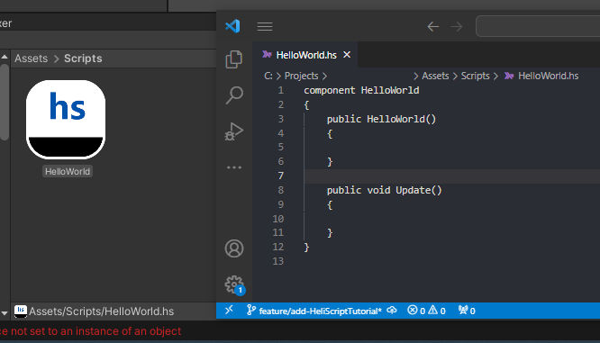
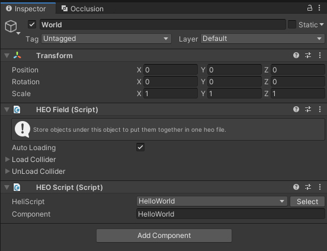
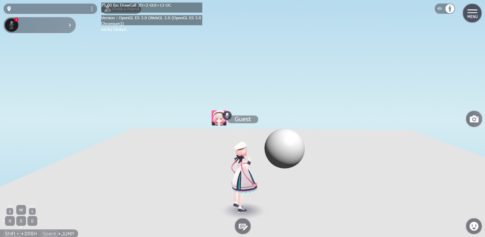

# HeliScript概要

Vket Cloudでは、HeliScriptというエンジン独自のスクリプトを使用してプログラミングを行うことができます。<br>
HeliScriptを使用すると、[アクション](../Actions/ActionsOverview.md)と比べてより複雑なギミック・挙動を実装できます。

HeliScriptの文法については[基本系](./hs_var.md)から順番に読むことで習得できます。<br>
また、ここでは以下にてHello Worldを出力する方法を通じて、基本的な実装の例を示します。

## HeliScriptの使い方の例 (Hello Worldをコンソールに出力する)

### 1. AssetsにHeliScriptファイルを追加する


初めに、HeliScriptを書き込むファイルを作ります。<br>
Projectウィンドウ(Assetsなどがあるところ)で右クリックして、**「HS script」**を選択し、任意のフォルダにHeliScriptファイルを追加します。

例として、ここではAssetsフォルダにScriptsフォルダを追加し、HelloWorld.hsという名前でHeliScriptファイルを新規生成しています。



### 2. HEOScriptをシーンに追加する



HeliScriptファイルを追加したら、次はシーンにHeliScriptの設定を行います。<pr>
HeliScriptは[HEOScript](../HEOComponents/HEOScript.md)コンポーネントを使用してシーン内に登場させます。
Inspector画面にてAdd Component > HEOScriptと選択してコンポーネントのアタッチを行います。

[HEOScript](../HEOComponents/HEOScript.md)コンポーネントでは実行したいHeliScriptファイルを選びます。<br>
メニュー右の「Select」を選択するとHeliScriptの一覧が出現するため、使いたいHeliScriptを選択します。

### 3. HEOWorldSettingにてデバッグモードを有効にする


今回実装するHelloWorldでは、デバッグログにて文字を出力するためにワールドのビルドをデバッグモードに設定する必要があります。<br>
デバッグモードを使うために[HEOWorldSetting](../HEOComponents/HEOWorldSetting.md)の[Debug Mode](../WorldEditingTips/DebugMode.md)を有効にします。

### 4. HeliScriptを書く

いよいよHeliScript本体を書いていきます。<br>
HelloWorld.hsの実装として以下に例を示します。

```
//コンポーネント
component HelloWorld
{   

    //コンストラクタ関数：ワールド入場時に一度だけ実行されます
    public HelloWorld()
    {
    //デバッグログに出力
    hsSystemOutput("Hello, World!\n");
    }

    //アップデート関数：毎フレーム実行されます
    public void Update()
    {

    }
}
```
### 5. Build And Runでテストする
コードの実装を完了した上で、Build And Runを実行すると画面上のデバッグログに"Hello, World!"が出力されます。


## HEOScriptの配置・オブジェクトの参照について

[HEOScript](../HEOComponents/HEOScript.md)をアタッチ可能なGameObjectは、スクリプトの対象となる[HEOField](../HEOComponents/HEOField.md)がアタッチされているオブジェクト及びその子オブジェクトです。<br>
詳しいHeliScriptの配置方法は[HEOScript](../HEOComponents/HEOScript.md)をご確認ください。


HeliScript内で各オブジェクトを参照する際は、後述するItem及びNodeによって取り扱います。<br>
例として、以下のように[HEOField](../HEOComponents/HEOField.md)下のexampleObjectがクリックされた際にメッセージを出力するスクリプトが書けます。

```
component example
{
    //ItemとPlayerを定義
    //ここではhsItemGetなどの取得関数を含め、オブジェクトの初期化はできないためにご注意ください
	Item	ex_Item;
	Player	ex_player;

    bool    ex_isPlayerInit; //Playerクラス初期化管理
	int		ex_ItemNodeIndex;

    public example()
    {
        //Itemを認識　Item名は.heoになっている物を指定する　今回はHEOField指定
        ex_Item = hsItemGet("World");

        ex_isPlayerInit = false;
        
        //ItemがHEO Fieldなので、その傘下にあるオブジェクトのノードを取得可能
        ex_ItemNodeIndex = ex_Item.GetNodeIndexByName("exampleObject");
    }

    public void update()
    {
        //Playerのインスタンス取得がまだの場合、一度だけhsPlayerGet()を実行する
        if(!ex_isPlayerInit){
        //Playerを認識・取得
        ex_player = hsPlayerGet();
        ex_isPlayerInit = true;
        }
    }

    //クリックしたとき、対象のノードを取得する。OnClickNodeの使い方はコールバック関数のページをご参照ください
    public void OnClickNode(int NodeIndex)
    {
        //クリック対象と上で取得したノードが一致したとき
    	if(NodeIndex == ex_ItemNodeIndex){
    	    //メッセージを表示
        	hsSystemOutput("exObj Clicked.\n");
        }
    }
}
```

!!! caution "Playerオブジェクトの初期化について"
    SDK Ver12.x以降より、Playerクラスの関数はコンストラクタでの呼び出しができなくなりました。<br>
    インスタンスの取得を行いたい際は、例として上記のようにフラグとなるbool変数を用意してコンストラクタ以外の関数にて呼び出してください。

スクリプトを[HEOScript](../HEOComponents/HEOScript.md)に設定し、ワールドをビルドすると以下のようにオブジェクトをクリックした際にメッセージが出力されます。



OnClickNodeなど、SDKに用意されているコールバック関数は[コンポーネント / コールバック関数](./hs_component.md)をご参照ください。

## Player / Item / Nodeについて

Vket Cloud独自の概念として、Player, Item, そしてNodeがあります。<br>
以下にて各概念の概要を解説します。

## Player

Vket Cloudにおいて、Playerはワールド内の操作主体である自身を指します。<br>
Playerの振る舞い方は[HEOPlayer](../HEOComponents/HEOPlayer.md)で定義されます。

PlayerのHeliScriptでの取り扱いは[Playerクラス](./hs_class_player.md)をご参照ください。

## Item

Vket Cloud上でワールドを構成する際、Player以外の各要素はItemとして表現されます。<br>
[HEOField](../HEOComponents/HEOField.md), [HEOObject](../HEOComponents/HEOObject.md), [HEOPlane](../HEOComponents/HEOPlane.md), [HEOActivity](../HEOComponents/HEOActivity.md)などがこれにあたります。

ItemのHeliScriptでの取り扱いは[Itemクラス](./hs_class_item.md)をご参照ください。

## Node

前述のItemのうち、[HEOField](../HEOComponents/HEOField.md)で定義されたItemに子オブジェクトがある場合、その子オブジェクトはItemのNodeとして扱われます。<br>
例として、以下の[HEOField](../HEOComponents/HEOField.md)に取り付けられたObjectA, ObjectB, ObjectC, ObjectC2, ObjectC3はNodeとなり、[Show/HideNode](../Actions/Node/ShowHideNode.md), [Enable/DisableCollider](../Actions/Node/EnableDisableCollider.md)などのアクションの対象となります。<br>

なお、[HEOField](../HEOComponents/HEOField.md)の子オブジェクトになっていない`ObjectD`はNodeではなく、かつItemでもない場合はビルド時にワールドに含まれないことに注意してください。


NodeのHeliScriptでの取り扱いは[Itemクラス](./hs_class_item.md)をご参照ください。