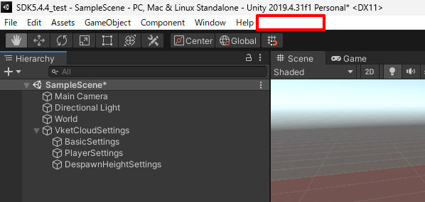

# バージョンアップ後によくあるトラブル

本ページでは、VketCloudSDKのバージョンを[新しいバージョンに更新](../AboutVketCloudSDK/SetupSDK_external.md#sdk)した際に発生する可能性のある現象と解決策を掲載しております。

もしバージョンアップ作業時に本ページに掲載されていない / 解決できない現象に遭遇した際は、[お問い合わせフォーム](https://www.hikky.co.jp/contact?type=service&category=general){target=_blank}もしくは[Vket CloudコミュニティDiscord](https://discord.com/invite/vsFDNTKdNZ){target=_blank}にてお気軽にお問い合わせください。

## メニューにVketCloudSDKタブが表示されない

VketCloudSDK更新後、Unityの上部メニューからVketCloudSDKが本来表示されるべき位置に表示されなくなる場合があります。



この場合、必須パッケージのバージョンの手動更新が必要な場合があるため、以下の手順で更新します。

1. Projectウィンドウの任意の箇所にて右クリックして表示されたメニューにて"Show in Explorer"を選択し、現在のプロジェクトをエクスプローラーにて開きます。

    

2. Manifest.jsonが格納されているPackagesフォルダまで遷移し、Manifest.jsonを開きます。

    

3. Manifest.jsonにて、VketCloudSDKに関するパッケージのバージョンが正しいものか確認します。

    例として、SDK Ver12.3.0ではパッケージが以下のバージョンである必要があります：

    ```

    {
    "dependencies": {
    "com.hikky.editortutorialsystem": "1.0.1",
    "com.hikky.vketcloudsdk": "12.3.0",
    "com.needle.deeplink": "1.2.1",
    //省略

    ```

上記にて列挙したSDK付随のパッケージのうち、Deeplinkパッケージがプロジェクトに存在しない現象が発生した場合は[手動での導入](../troubleshooting/InstallingDeeplink.md)をお試しください。

また、稀に必須パッケージであるEditorTutorialSystemも自動インポートされない場合があるため、その際は[SDK Install Manager](../AboutVketCloudSDK/SetupSDK_external.md#step-2)と同様の手順で以下のパッケージを導入してください。

|  項目  |  値  |
| ---- | ---- |
|  Name  |  EditorTutorialSystem  |
|  URL  |  https://registry.npmjs.org  |
|  Scope(s)  |  com.hikky.editortutorialsystem  |  

## バージョンアップ後にComponentがMissingとして表示される

[SDKのバージョンアップ](../AboutVketCloudSDK/SetupSDK_external.md)を行った際に、バージョンアップ前のコンポーネントがMissingとして表示される場合があります。


Missingになったコンポーネントについては該当のコンポーネントを再度アタッチ・設定し直すことで正常に動きます。<br>
バージョンアップの際はバージョンアップ前の状態を確認できるようにバックアップを行うことを**強く**おすすめします。

以下のコンポーネントについてMissingになる可能性を確認しております：

- VKCRotateAnimation/HEO Animation
- VKC Node Collider/HEO Collider
- VKC Node Cylinder Collider/HEO Cylinder Collider
- VKC Node Ibl Cube Map/HEO lbl Cube Map
- VKC Node Blendshape Translator/HEO Info
- VKC Node Mesh Collider/HEO Mesh Collider
- VKC Node Mirror/HEO Mirror
- VKC Node Reflection Probe Type/HEO Object Type
- HEO Reflection Probe
- VKC Node/HEO Shadow
- VKC Node LOD Level/HEO LOD Level
- VKC Node UV Scroller/HEO UV Scroller

!!! note caution
    Ver5.4からVer9.3へのアップデート時においてはHEOWorldSetting > Avatars > Avatar Fileの設定が欠落する恐れがあるため、欠落している場合は再設定をお願いいたします。

HEOWorldSetting > Avatars > Avatar Fileにて空欄がある、Avatar Fileが1つも設定されていない場合はビルドエラーが発生したり、初期状態のアバターが表示されない状態となります。<br>


SDKでは初期状態のアバターとして用意しているAvatarFileがあるため、バージョンアップ後に空欄が発生している際はこちらをご利用ください。


## Vket Cloud Settingsにおける設定が空欄になっている / 旧バージョンのHEOWorldSettingコンポーネントから要素が引き継がれない

Ver12.3以降、これまで[HEOWorldSetting](../VKCComponents/HEOWorldSetting.md)、[HEOPlayer](../VKCComponents/HEOPlayer.md)、[HEODespawnHeight](../VKCComponents/HEODespawnHeight.md)コンポーネントにて設定していたワールドに関する設定は[VketCloudSettings](../VketCloudSettings/Overview.md)にて設定されるようになりました。

バージョンアップ時に旧HEOコンポーネントの設定内容は自動でVketCloudSettingsに移植されますが、稀に以下の画像のように正しい設定が移植されず、空欄のままになる場合があります。


このとき、該当のVketCloudSettingsコンポーネントの三点リーダー（…）を選択し、「Reset」を選択するとデフォルトの値が入力されます。


## 設定画面でのバージョン表記が旧バージョンのままになっている / HeliScript・ギミックが動かない

既存のプロジェクトからバージョンを9.3へアップデートした後、ビルドを行ったワールドにて設定画面の右下に表示されているバージョン表記が旧バージョンのままになっている場合があります。<br>


その際はSDKツールバーのVketCloudSDK > Clear Cacheを実行すると解消されます。


!!! note caution
    バージョンアップ後にブラウザ側のキャッシュが原因でHeliScript・ギミックが動かない場合があります。<br>
    該当の現象が発生した際はブラウザのキャッシュクリアをお試しください。


## ファイルの破損エラーが表示される

新しいバージョンのプロジェクトにて存在しない、もしくは更新されているスクリプトがアタッチされている場合、シーンを開いた際に以下のメッセージが表示される場合があります。


本不具合が発生した際は、プロジェクトフォルダのLibraryフォルダ及びTempフォルダを消去した上でプロジェクトを再起動させると解消します。

### 操作手順

1\. Unityプロジェクトを開いている場合は一度閉じる

2\. エクスプローラにてSDKが含まれているUnityプロジェクトを開く<br>※Unity Hubにて該当のプロジェクトを右クリックし、「エクスプローラーで表示」を選択すると表示されます


3\. Library及びTempフォルダを消去する


4\. Unityプロジェクトを再度開き、エラーの解消を確認する
